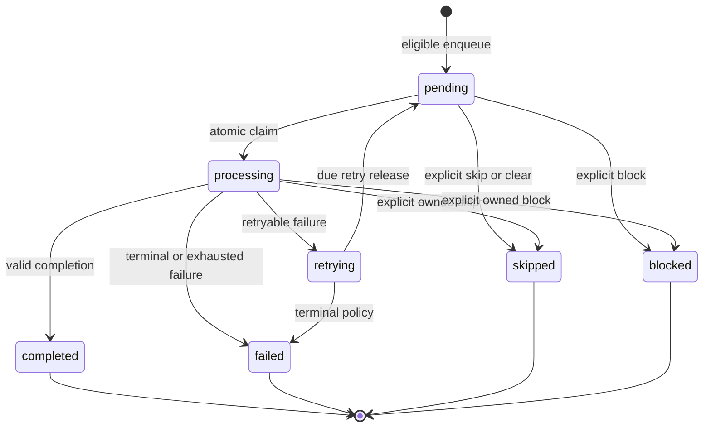

# Page Job State Machine

State-machine version is `1`. States are `pending`, `processing`, `completed`, `failed`, `retrying`, `skipped`, and `blocked`. Terminal states are `completed`, `failed`, `skipped`, and `blocked`; they cannot reopen in Product Phase 6.

Every edge is allowlisted by `VALID_JOB_TRANSITIONS`; all other 39 state pairs fail as `QUEUE_INVALID_TRANSITION`. Enqueue requires an eligible, queueable, revision-matched Scope Decision. Claim requires a due pending Job and increments the attempt only after the guarded state update. Processing exits require the active claim token. Retry release requires `retrying`, due time, and remaining attempts.

Identical operations replay their first result from the persistent operation ledger and do not duplicate attempts or transitions. Conflicting requests using the same key fail. `leased`, `abandoned`, `recovering`, `paused`, and crash-recovery states are not Phase 6 states; Lease expiry and recovery belong to Product Phase 7.
