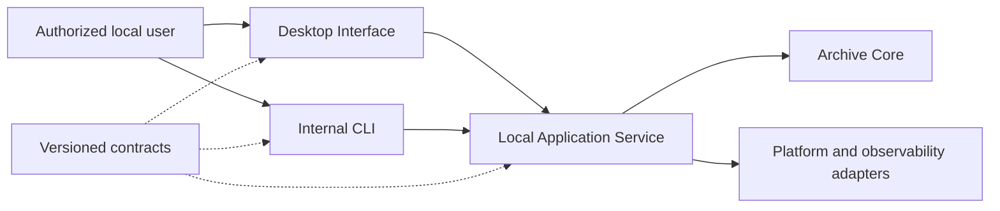

# System Context

The authorized local user operates either the English Electron desktop shell or internal CLI. Both call the same local Application Service and Archive Core through contract 1.0.0. Product Phase 3 opens no network listener and contacts no target website.

External targets, a browser engine, SQLite, protected stores, proxy services, and release infrastructure are outside the implemented context. They require their planned product phases and new threat/evidence review.
