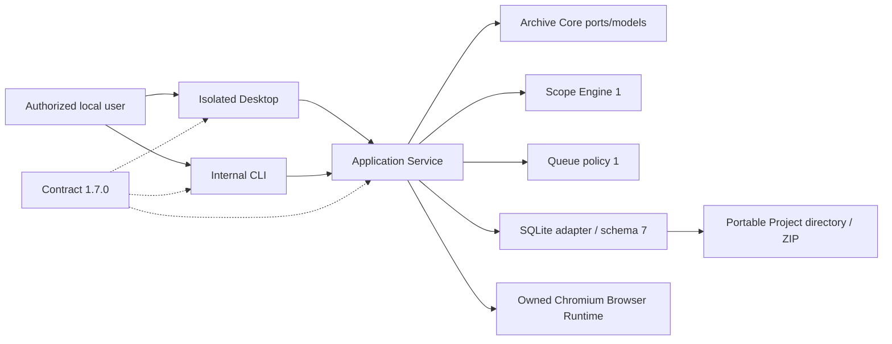

# System Context

## Product Phase 8 context

An authorized operator selects a Project/queued Job through Desktop or CLI. Application Service composes the Scope/Queue/Recovery stores with Browser Runtime and Rendering Engine. Owned Chromium may contact only runtime-authorized destinations; deterministic loopback is test-only. Final rendered artifacts remain inside the Project. There is no automatic discovery, Asset Downloader, authentication provider, proxy, remote control service, or external telemetry actor.

In the current baseline the authorized local user can manage a portable Project/Profile, evaluate scope, queue an eligible Page Job, and run one controlled Browser Render through contract 1.7.0. A bounded approved Interaction Plan can also run through the Browser Runtime foundation, and a privileged Secret Store can manage opaque references/encrypted values without exposing them to the general transport. Phase 9 discovery is absent and no interaction-generated URL is enqueued. Owned Chromium and the system DNS resolver are runtime actors behind authorization; authentication/session UI, OTP, proxies, production downloaders, discovery Workers, and Worker Pools remain outside the running system.

The English Electron Desktop and internal CLI call one local Application Service. The service composes Archive Core ports, Scope/Queue/Recovery/Rendering/Interaction policy, Browser Runtime, and the Node SQLite adapter. SQLite schema 7 persists Leases, Checkpoints, Run control, Recovery, Render, Interaction, output, and execution-session state. The Render and Interaction runtimes can make only authorized outbound GET/HEAD requests; fixture servers are test-only and no production network listener exists.

Queue claims do not represent an actual Worker. Lease ownership, Heartbeats, Checkpoints and recovery are Product Phase 7; rendering, discovery, downloading, authentication, proxies, archive output/runtime, and release packaging remain future capabilities.
