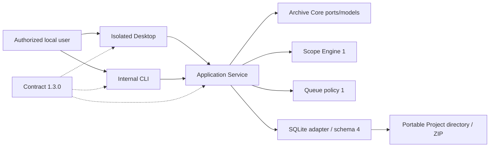

# System Context

In Product Phase 6 the authorized local user can manage a portable Project/Profile, evaluate local URL scope, enqueue synthetic Page Jobs, inspect Queue state/history/statistics, and run controlled claim/terminal/retry operations through contract 1.3.0. Websites, DNS resolvers, proxies, remote services, browser engines, and Worker processes remain outside the running system.

The English Electron Desktop and internal CLI call one local Application Service. The service composes Archive Core ports, pure Scope Engine and Queue policy, and the Node SQLite adapter. SQLite schema 4 persists Profile revisions, Scope Decisions, Jobs, discoveries, attempts, transitions, and idempotency results. No network listener or website request exists.

Queue claims do not represent an actual Worker. Lease ownership, Heartbeats, Checkpoints and recovery are Product Phase 7; rendering, discovery, downloading, authentication, proxies, archive output/runtime, and release packaging remain future capabilities.
