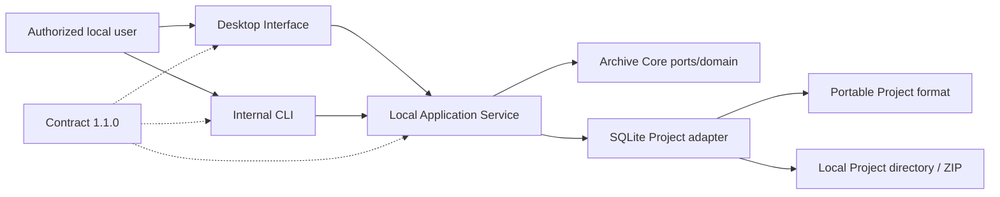

# System Context

The authorized local user operates the English Electron desktop or internal CLI. Both call one local Application Service through contract `1.1.0`. Archive Core owns domain/storage-port types; the service composes the Node SQLite adapter. Product Phase 4 opens no network listener and contacts no website.

External targets, browser engines, protected stores, proxy services, and release infrastructure remain outside the implemented context.
